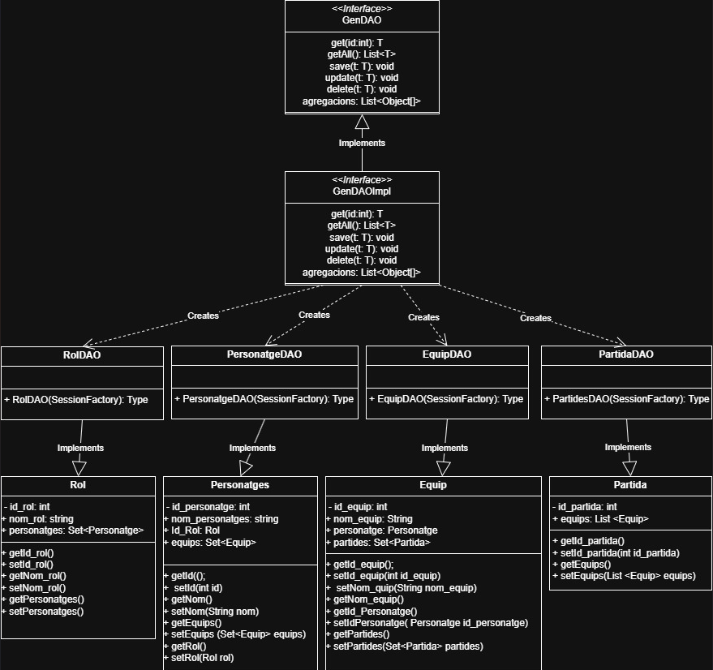

# Activitat A01 UF4 RA1: Apliquem el patró DAO
## Preguntes de reflexió i sintesi
### Accés a dades
1. De quina lògica d’aplicació s’encarrega el Patró DAO?
   
   S'encarrega de la lògica d'accés a dades, ja que es separa de la lògica de negoci. Amb aquest patró es permet fer els CRUDS de les dades amb les que es treballen. Llavors mitjançant aquest patró es pot connectar a la base de dades i facilitar les accions que la lògica de negoci no pot.

2. Per què considereu què és útil el patró DAO i en què us ha servit?
   
   Principalment és més util perque s'estalvia codi a l'aplicació, per tant, el codi és més modular i fàcil d'entendre. Això vol dir bàsicament que tots està millor estructurat i divitit pel seu propòsit.

3. Heu hagut de fer cap ajust al vostre codi d’aplicació (Main, Controladors, Vistes, altres classes que no siguin DAO, etc.) ? Si és així, detalleu de forma breu quins canvis heu fet i per què?
   
   Molt resumidament, com que ja no hi havia cap mètodes als DAO vaig fer canvis al main per afegir els noms correctes dels mètodes CRUD (save, update, delete, agregacions). 
   
   A més, vaig haver de canviar molt breument alguns mètodes que feia prints de la informació que no hi estaven en aquesta pràctica, per tant els vaig afegir per poder veure els resultats a la Terminal.

4. D’igual forma que s’ha fet a l’enunciat, completeu el diagrama de classes de l’activitat A01 de la UF2 incorporant les interfícies, la classe abstracta i els DAOs.
   Per acoblar això, cal que relacioneu cada classe del model amb el seu DAO (sols aquelles classes que heu treballat a l’A03, no totes!!! ):
   
   
   
5. Per últim valoreu el paper que hi juga la classe abstracta. És en tots els casos necessària? En el cas de l’activitat A02 de la UF2, on vau emprar JDBC, penseu que seria d’utilitat?

   Crec que la classe abstracta pot ser molt útil en alguns casos, especialment quan volem definir funcionalitats comunes per a diferents DAOS i nmo repetir codi. Pero no sempre és necessària, ja que si els DAOS no fan ús dels mateixos metodes no serviria, pero en aquest cas si va ser necessària ja que es feia a totes les clases.